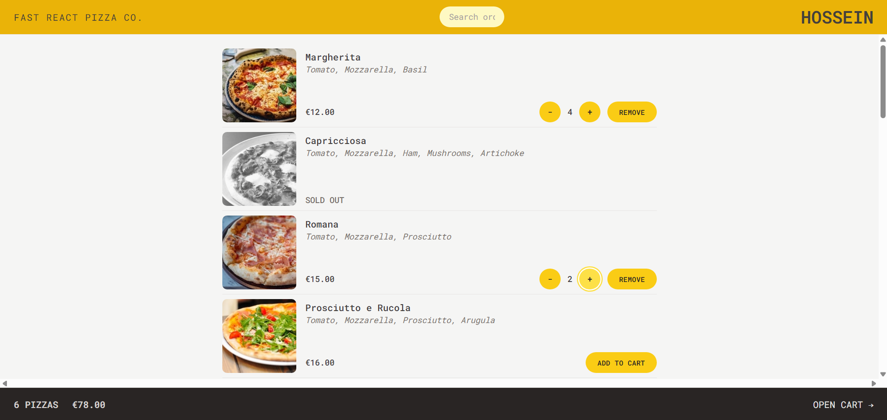
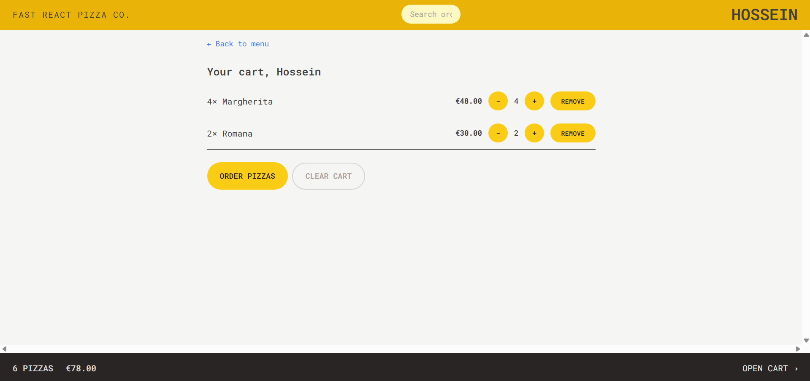
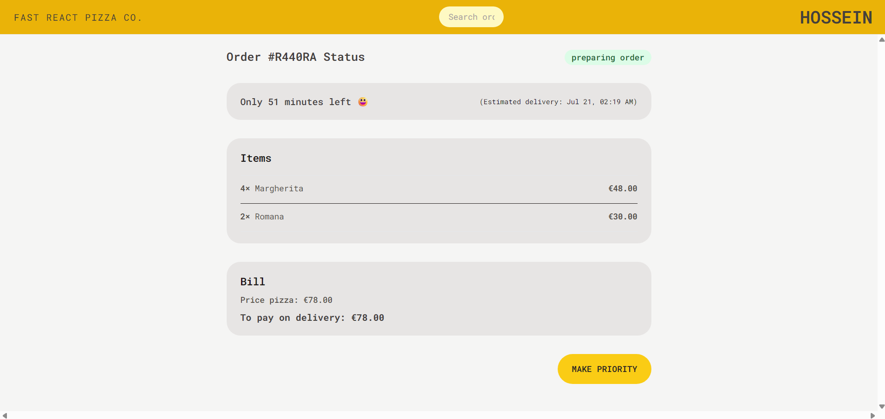

# Fast React Pizza

A modern, responsive pizza ordering web application built with React, featuring a clean UI, seamless cart management, and real-time order tracking.



## Overview

Fast React Pizza is a React-based pizza ordering application that demonstrates modern web development practices. Built with React Router v6 for navigation, Redux Toolkit for state management, and Tailwind CSS for styling, this app provides a smooth user experience from menu browsing to order placement.

## Key Features

- **Interactive Menu**: Browse through a variety of pizzas with detailed ingredient information
- **Smart Cart System**: Add/remove items, adjust quantities, and see real-time price calculations
- **Priority Ordering**: Option to expedite orders for an additional fee
- **Address Integration**: Automatic geolocation detection for delivery addresses
- **Order Tracking**: Real-time order status and estimated delivery countdown
- **Responsive Design**: Fully optimized for mobile and desktop experiences

## Demo Preview





## Installation

1. Clone the repository:

```bash
git clone https://github.com/Hossein187/Pizza-Delivery.git
cd Pizza-Delivery
```

2. Install dependencies:

```bash
npm install
```

3. Start the development server:

```bash
npm run dev
```

The application will be available at `http://localhost:5173`

## Usage

### For Customers

1. Browse the menu to view available pizzas
2. Add pizzas to your cart with customizable quantities
3. Proceed to checkout and fill in your delivery details
4. Track your order status in real-time

### For Developers

The application uses a mock API. To customize data:

- Modify `src/services/apiRestaurant.js` for menu/order endpoints
- Adjust styling in `tailwind.config.js`
- Update state logic in `src/features/cart/cartSlice.js`

## Screenshots

### Menu Browsing


### Cart Management


### Order Tracking


## Technical Stack

- **React 18+** - Component-based UI development
- **React Router v6** - Declarative routing and data loading
- **Redux Toolkit** - Predictable state management
- **Tailwind CSS** - Utility-first CSS framework
- **Vite** - Fast build tool and development server

## Project Structure

```
src/
├── features/
│   ├── cart/          # Cart management components and Redux slice
│   ├── menu/          # Menu display and loader
│   ├── order/         # Order creation and tracking
│   └── user/          # User profile and address management
├── services/          # API integration layer
├── ui/               # Reusable UI components
└── utils/            # Helper functions
```

## Contributing

We welcome contributions! Please follow these steps:

1. Fork the repository
2. Create a feature branch (`git checkout -b feature/amazing-feature`)
3. Commit your changes (`git commit -m 'Add amazing feature'`)
4. Push to the branch (`git push origin feature/amazing-feature`)
5. Open a Pull Request

Please ensure your code follows the existing style and includes appropriate tests.

## License

This project is licensed under the MIT License - see the [LICENSE](LICENSE) file for details.

## Acknowledgments

Built as part of a React learning journey. Credits to [Jonas Schmedtmann](https://twitter.com/jonasschmedtman) for the excellent React course inspiration.