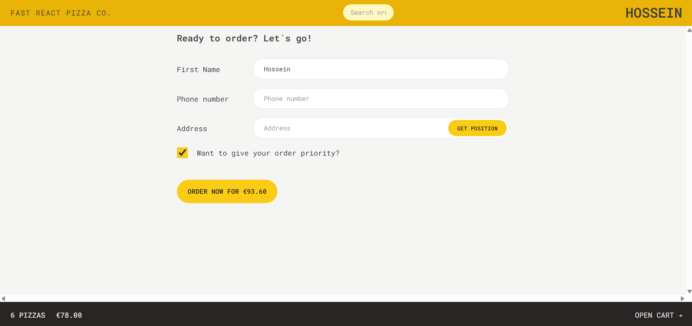

# 🍕 Fast React Pizza

A modern pizza ordering web application where you can browse menus, manage your cart, and place orders with real-time tracking.





## ✨ Features

- 🍕 **Interactive Menu** — browse through a variety of pizzas with detailed ingredients
- 🛒 **Smart Cart System** — add/remove items, adjust quantities with real-time price calculation
- 🚀 **Priority Ordering** — option to expedite orders for an additional fee
- 📍 **Geolocation Integration** — automatic address detection via browser Geolocation API
- 💰 **Currency Formatting** — real-time price display in EUR with proper number formatting
- 🔒 **Protected Routes** — order pages with form validation and error handling
- ⚡ **Client-side Routing** — React Router v6 with loaders and actions for data fetching
- 🗂️ **Global State** — Redux Toolkit for cart management and user state
- 📱 **Fully Responsive** — optimized for both mobile and desktop experiences

## 🛠️ Built With

- **React 18+** + **Vite**
- **React Router v6** — loaders, actions, and nested routes
- **Redux Toolkit** — global cart and user state management
- **Tailwind CSS** — utility-first styling
- **json-server** — mock REST API for local development
- **ESLint** + **React Doctor** — code quality and React best practices

## 🚀 Getting Started

### Prerequisites

- Node.js (v18+)
- npm

### Installation

```bash
# Clone the repo
git clone https://github.com/Hossein187/Pizza-Delivery.git
cd Pizza-Delivery

# Install dependencies
npm install
```

### Running locally

```bash
# Start Vite dev server
npm run dev
```

The app will be running at `http://localhost:5173`.

### Other scripts

```bash
npm run build      # production build
npm run preview    # preview the production build locally
npm run lint       # check code with ESLint
```

## 📁 Project Structure

```
src/
├── features/
│   ├── cart/        # Cart management components and Redux slice
│   ├── menu/        # Menu display and loader
│   ├── order/       # Order creation and tracking
│   └── user/        # User profile and address management
├── services/        # API integration layer
├── ui/             # Reusable UI components (Button, Loader, Error, etc.)
└── utils/          # Helper functions (formatting, calculations)
```

## 🧠 What I Learned

- Managing asynchronous form submissions with React Router actions
- Implementing geolocation-based address detection with error handling
- Building a complete cart system with Redux Toolkit
- Using nested routes and layout components for better code organization
- Handling real-time price calculations with currency formatting

## 📄 License

This project is licensed under the MIT License.

## 🔗 Live Demo

[View Live Demo](#) <!-- add your Vercel link here once deployed -->